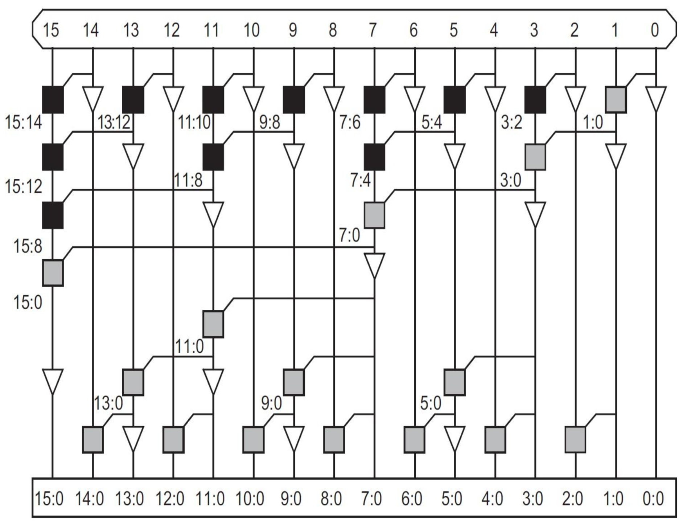
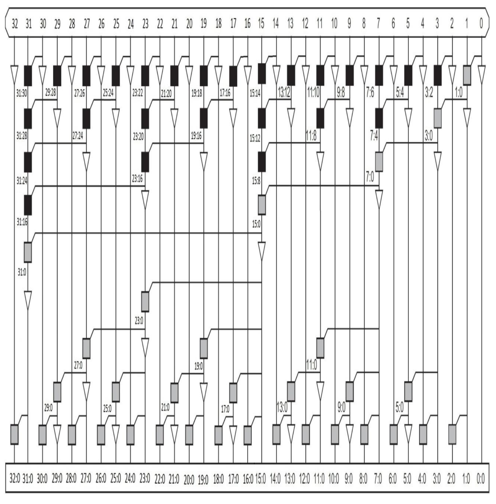

# Generating verilog codes of Brent Kung Adder with python

## Adder Schematic:

<em>* "A LOW-POWER METHODOLOGY FOR CONFIGURABLE WIDE KOGGE-STONE ADDERS", Z. Moudallal, et al. </em>

## Group PG Logic:

<table>
    <thead>
        <tr>
            <th>Bitwidth</th>
            <th>Group PG Logic</th>
        </tr>
    </thead>
    <tbody>
        <tr>
            <td>16</td>
            <td></td>
        </tr>
        <tr>
            <td>32</td>
            <td></td>
        </tr>
    </tbody>
</table>

## Parameters:

- out_path: .v files path
- adder_type: type of adder must be ['brent_kung']
- bitwidth: input bitwidth. input bitwidth must be a power of 2.

## Generating Verilog Codes

- Set <em>out_path</em> and <em>bitwidth</em> in `generate.sh`
- Run `bash generate.sh`
- For more help, run `python main.py --help`

## Generating Test Bench:

- Set parameters in <em>\_main()</em> function of `test_bench_generator.py`
- Run `bash test_bench_generator.py`
